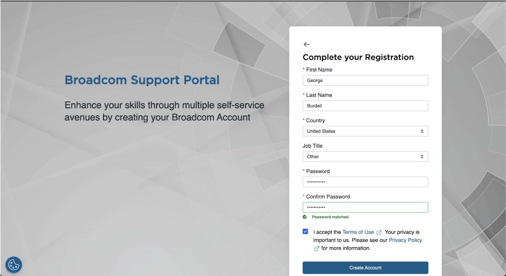
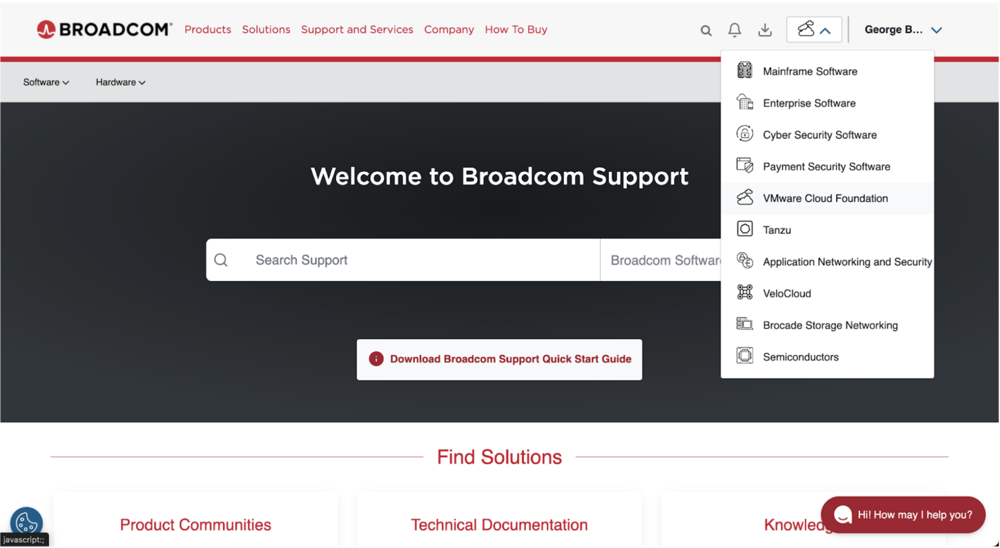
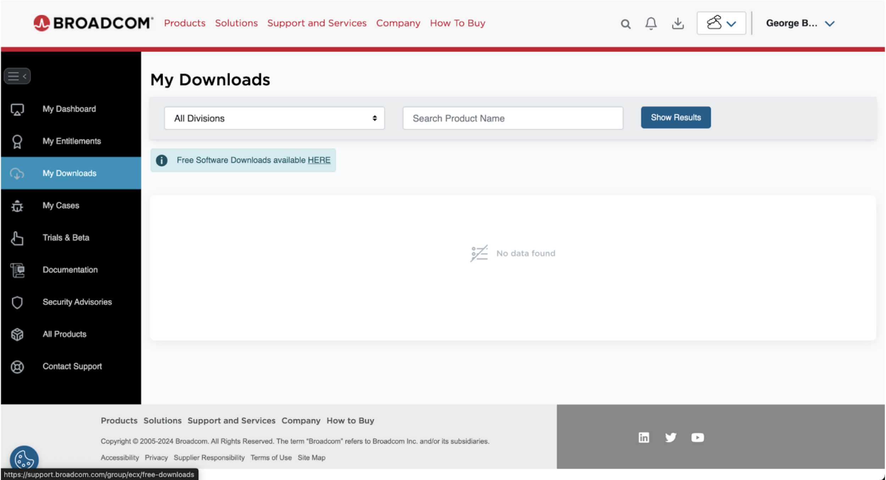
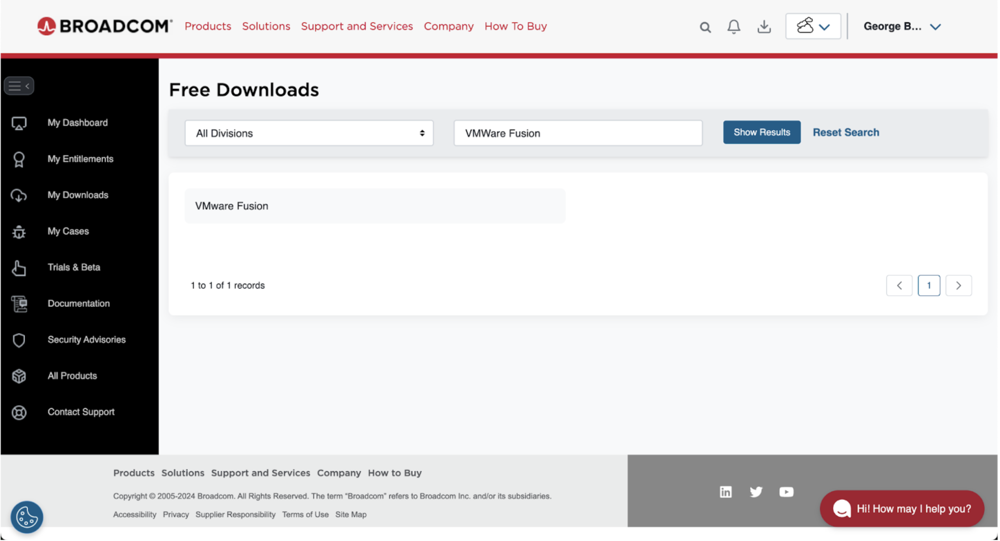
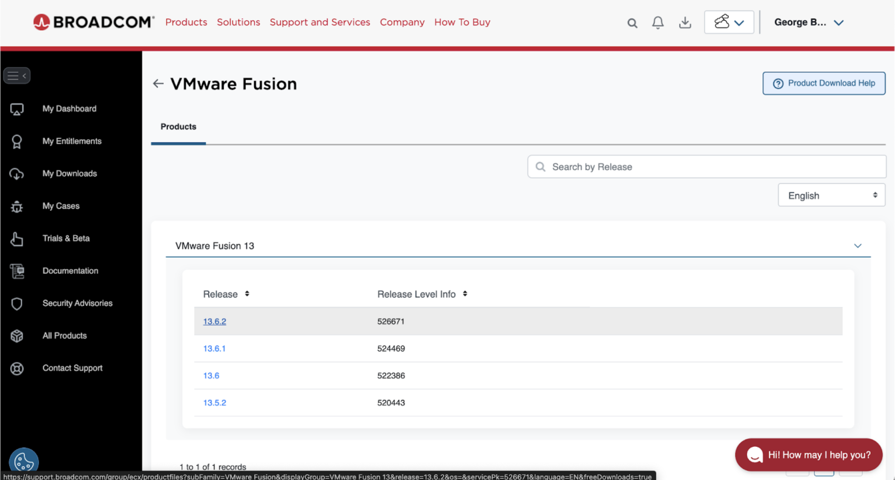
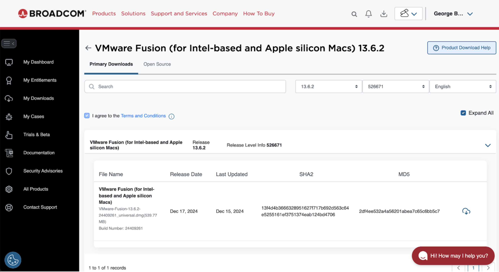
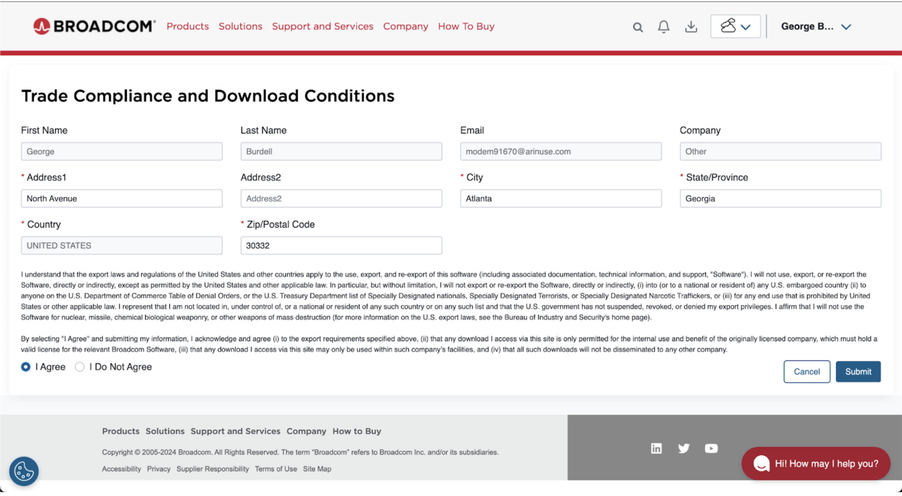

# quartus-on-mac
Instructions For Installing Quartus Prime Lite on MacOS (Silicon Chip)

## MacOS Silicon Chip Quartus Installation  
**Shaan Patel**  
**ECE 2031**  

---

## VMWare Fusion Installation  
VMware Fusion is a virtualization software that allows users to run different operating systems, like Windows or Linux, on their macOS computers without needing to reboot. This is the basis of how we will be running Quartus on a Mac machine.

**NOTE:** This process will take up 60-70GB of storage on your computer. It is very difficult to resize the virtual disk after you make a virtual machine without corrupting the machine itself. Please make sure you have enough storage before beginning this process.

### Step 1: Creating a Broadcom Account  
Navigate to [Broadcom's website](https://www.broadcom.com/) and click "Support Portal" on the top right corner, then click "Register".

Fill out the registration information, then click "Create Account".

If the site asks you to build your profile, click "I’ll do it later".

### Step 2: Downloading VMWare Fusion  
Now that you have a Broadcom account, you can download the free-to-use VMWare Fusion. Click the dropdown in the top right and navigate to "VMWare Cloud Foundation".

Then click "My Downloads" on the left pane and then click the "Free Software Downloads available HERE" button.

Type in "VMWare Fusion" in the "Search Product Name" field on the top right and click enter.

Click the "VMWare Fusion" button, expand the dropdown, and click the link for the latest version.

Agree to the terms and conditions by checking the box. Then you can click the button with the cloud and down arrow on the right-hand side. Press "Yes" to the popup that prompts you for additional verification.

Fill out your additional information and click "Submit".

Click the checkbox next to the terms and conditions again, and start the download.

### Step 3: Installing VMWare Fusion  
Run the `.dmg` file that you just downloaded and double-click the `VMWare Fusion.app` icon in the center of the screen to install VMWare Fusion.

When prompted with ‘VMWare Fusion is an app downloaded from the Internet. Are you sure you want to open it?’, click "Open". Give the app administrative privileges by entering your Mac’s username and password. This will then bring up the license agreement. Click "Agree".

---

## Windows 11 Installation  
Now that you have the hypervisor required to run Windows on your Mac computer, you must install Windows. Run VMWare Fusion if it isn’t running already after installation. If a popup saying "Unable to access Accessibility" appears, go to `System Preferences > Privacy and Security > Accessibility` and allow VMWare Fusion to control your computer.

### Step 1: Installing Windows 11 Arm  
- Select "Create a custom virtual machine" and click "Continue".
- Select "Microsoft Windows", then select "Windows 11 64-bit Arm", then press "Continue".
- Ensure only "UEFI" is selected and leave the "UEFI Secure Boot" box unchecked. Click "Continue".
- Create a memorable password to encrypt only the files needed to support a TPM and click "Continue".
- Create a new virtual disk for your virtual machine to run off of and click "Continue".
- Click "Finish".

### Step 2: Customize the Virtual Machine settings  
If the newly created virtual machine starts running, click "Virtual Machine" and then "Shut Down" so that you can edit the settings.

- Click "Virtual Machine" > "Settings..." from the top menu.
- Click "Processors and Memory" from the popup.
- Allocate half or less than half of available processor cores and RAM (e.g., 6 cores, 8 GB RAM if 12 cores and 16 GB RAM are available).
- Click "Show All" in the top left and select "Display".
- Ensure "Accelerate 3D Graphics" is turned on.
- Close the settings pane.

### Step 3: Finish Setting Up Windows in the Virtual Machine  
Run the virtual machine and install Windows. Disable any nonessential features and do not buy a product key, as Quartus does not require an activated Windows product.

---

## Quartus Prime Lite Installation  
Now that you have the hypervisor and the correct OS running, you can install Quartus Prime Lite. Since this is on a virtual machine on a silicon chip-based computer, some driver settings need to be modified for DE10 board compatibility.

### Step 1: Install Quartus Prime Lite  
Follow the instructions in the [Lab 0 manual](https://powersof2.gatech.edu/cas/labmanual/manual.php?lab=0) within your Windows virtual machine.

**Note:** Do not begin building your first project yet; just install the required software.

### Step 2: Alter the drivers to make your system compatible with the DE10  
The Intel 64-bit drivers can be installed in an ARM 64-bit version of Windows, but modifications are needed:

1. Install the ARM-compatible driver file from [Google Drive](https://drive.google.com/file/d/1MKYReSuQtBxCYf79mcKUrJuw7NSF-VlI/view?usp=sharing) in your Windows virtual machine's `Downloads` folder.
2. Extract the files and open `usbblasterii.inf` with Notepad.
3. Replace the line `CatalogFile=usbblasterii.cat` with `;CatalogFile=usbblasterii.cat` (add a semicolon at the beginning).
4. Replace all occurrences of "amd64" with "arm64" (use Ctrl+H for find and replace).
5. Save the file.
6. Disable driver signature enforcement:
   - `Settings > System > Recovery`
   - Click "Restart now" under "Advanced startup"
   - Select "Troubleshoot" > "Advanced options" > "Startup Settings"
   - Click "Restart", then press `7` for "Disable driver signature enforcement".
7. Open "Device Manager", right-click "Unknown device" (DE10 must be powered on and connected), and select "Update driver".
8. Choose "Browse my computer for drivers" and select the modified `usbblasterii.inf` folder.
9. Click "Next" and select "Install this driver software anyway".

### Step 3: Run Quartus Prime Lite and Verify Success  
To verify the installation:

- Open Quartus, click "Tools", and select "Programmer".
- Click "Hardware Setup".
- In the "Currently selected hardware" dropdown, check if the SoC is available.
- Ensure the DE10 is powered on, connected to your Windows virtual machine, and properly linked to your Mac.

With this setup complete, you can now work on prelabs from your Mac even if you don’t have a Windows machine. **Good luck!**
